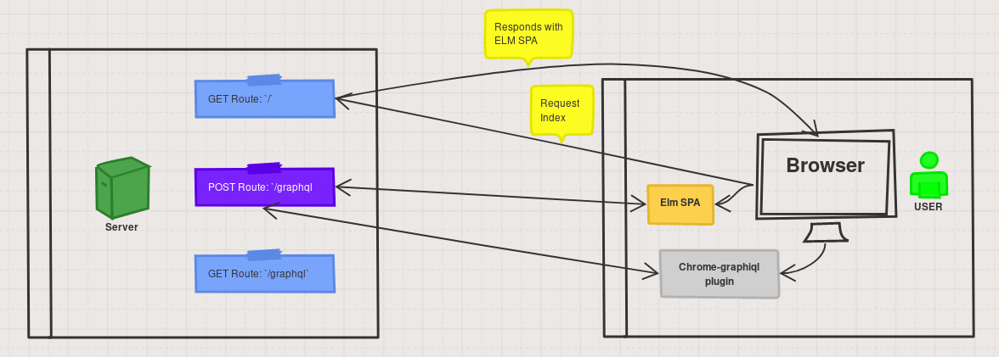

# hs-graphql-wai-elm

## Overview

Graphql server that sends out ELM application on GET request to root route `/`. Elm app subsequently makes graphql POST requests on `/graphql` route.

---

### Haskell Wai server + Graphql-api

#### Wai server
The wai server opens up GET and POST routes to /graphql for incoming graphql queries that are subsequently handled by Graphql-api.

A GET route on `/` sends `/spa/index.html` out (index.html is embedded with a simple elm Single Page Application (SPA).

The `/graphql` POST route can also be queried with the chrome-graphiql plugin. Just set the server address to `http://localhost:8000/graphql`. Do NOT forget the `http://`

#### Graphql-api
Graphql-api is, as far as I know, the farthest along graphql server module for Haskell (23/December/2017).
It's a work in progress. I have successfully parsed requests for data from the Elm client, but still working on bringing Graphql-api closer to spec.

---

### Elm client

Simple SPA at present (23/December/2017).
Send request to server at `localhost:8000/graphql`
The `/spa` directory holds all of the elm code. It must be compiled separately with `elm-make index.elm --output=index.html`

#### Elm-graphql

Roll query document and interpret response. Print graphql query and response.
